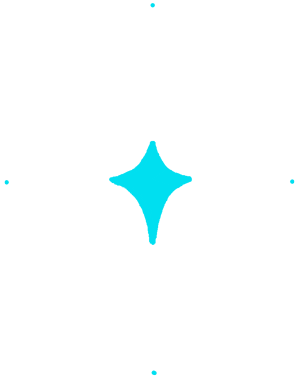

<a href="#">
  
</a>

<br />
<br />

<div align="center">
  <a href="#">
    
  </a>

  <a href="#">
    
  </a>

  <a href="#">
    
  </a>
</div>

##


<br />
<br />

- 🖥️ Cursando Engenharia de Computação na instituição de ensino Centro Universitário Eniac.
- 🖥️ Cursando Análise e Desenvolvimento de Sistemas na instituição de ensino Fatec Guarulhos.
- 💻 Sou formado em Técnico de Informática.
- 🤟 Cursando Inglês na instituição de ensino Wizard.
- 🏡 Sou Brasileiro, moro em Guarulhos-SP.

<div align="right">
  <a href="#">
    
  </a>
</div>

<a align="left" href="#"></a>

<br />

<div align="center">
  <a href="#">
    
  </a>

  <a href="#">
    
  </a>
</div>

<br />

<div align="center">

[](#)

</div>

<br />

<a align="left" href="#"></a>

## 📈 Análise de Desenvolvimento Semanal

[](#)

<br />
<br />

<details>
<summary><h3>:zap: Recent GitHub Activity</h3></summary>

<!--RECENT_ACTIVITY:start-->
1. 📔 Created new repository [GabrielGuedess/api-movie-play](https://github.com/GabrielGuedess/api-movie-play)<br>
2. ⭐ Starred [barbisliboni/auth-jwt](https://github.com/barbisliboni/auth-jwt)<br>
3. ⬆️ Pushed 1 commit(s) to [GabrielGuedess/GabrielGuedess](https://github.com/GabrielGuedess/GabrielGuedess)<br>
4. ⬆️ Pushed 1 commit(s) to [GabrielGuedess/Annotations-Tag](https://github.com/GabrielGuedess/Annotations-Tag)<br>
5. ⭐ Starred [showtime-xyz/showtime-tab-view](https://github.com/showtime-xyz/showtime-tab-view)<br>
6. ⭐ Starred [vercel/ms](https://github.com/vercel/ms)<br>
7. ⬆️ Pushed 1 commit(s) to [GabrielGuedess/GabrielGuedess](https://github.com/GabrielGuedess/GabrielGuedess)<br>
8. ⬆️ Pushed 1 commit(s) to [GabrielGuedess/NextJs-Boilerplate](https://github.com/GabrielGuedess/NextJs-Boilerplate)<br>
9. ⬆️ Pushed 1 commit(s) to [GabrielGuedess/Annotations-Tag](https://github.com/GabrielGuedess/Annotations-Tag)<br>
10. ⬆️ Pushed 1 commit(s) to [GabrielGuedess/GabrielGuedess](https://github.com/GabrielGuedess/GabrielGuedess)<br>
<!--RECENT_ACTIVITY:end-->

<!--RECENT_ACTIVITY:last_update-->
<p align="center">Last refresh: <b>Wednesday, May 3rd, 2023, 5:08:52 AM BRT</b>
<!--RECENT_ACTIVITY:last_update_end-->

</details>

<details>
<summary><h3>:clock230: WakaTime Stats</h3></summary>

  <!--START_SECTION:waka-->


**🐱 Meus dados no GitHub** 

> 📦 2.0 MB Usado no armazenamento do GitHub 
 > 
> 🏆 488 Contribuições no ano de 2023
 > 
> 💼 Aberto para contratação
 > 
> 📜 52 Repositórios Públicos 
 > 
> 🔑 2 Repositórios Privados 
 > 
**Eu sou noturno 🦉** 

```text
🌞 Manhã                  321 commits         ██░░░░░░░░░░░░░░░░░░░░░░░   09.60 % 
🌆 Tarde                  414 commits         ███░░░░░░░░░░░░░░░░░░░░░░   12.38 % 
🌃 Noite                  1194 commits        █████████░░░░░░░░░░░░░░░░   35.70 % 
🌙 Madrugada              1416 commits        ███████████░░░░░░░░░░░░░░   42.33 % 
```
📅 **Sou mais produtivo em Sexta-Feira** 

```text
Segunda-Feira            427 commits         ███░░░░░░░░░░░░░░░░░░░░░░   12.77 % 
Terça-Feira              563 commits         ████░░░░░░░░░░░░░░░░░░░░░   16.83 % 
Quarta-Feira             537 commits         ████░░░░░░░░░░░░░░░░░░░░░   16.05 % 
Quinta-Feira             538 commits         ████░░░░░░░░░░░░░░░░░░░░░   16.08 % 
Sexta-Feira              576 commits         ████░░░░░░░░░░░░░░░░░░░░░   17.22 % 
Sábado                   394 commits         ███░░░░░░░░░░░░░░░░░░░░░░   11.78 % 
Domingo                  310 commits         ██░░░░░░░░░░░░░░░░░░░░░░░   09.27 % 
```


📊 **Esta semana eu gastei meu tempo em** 

```text
🔥 Editores: 
VS Code                  17 hrs 49 mins      █████████████████████████   100.00 % 

💻 Sistema operacional: 
WSL                      17 hrs              ████████████████████████░   95.46 % 
Windows                  48 mins             █░░░░░░░░░░░░░░░░░░░░░░░░   04.54 % 
```

**Eu geralmente programo em TypeScript** 

```text
TypeScript               34 repos            ███████████████░░░░░░░░░░   59.65 % 
JavaScript               6 repos             ███░░░░░░░░░░░░░░░░░░░░░░   10.53 % 
Java                     5 repos             ██░░░░░░░░░░░░░░░░░░░░░░░   08.77 % 
Dockerfile               1 repo              ░░░░░░░░░░░░░░░░░░░░░░░░░   01.75 % 
Go                       1 repo              ░░░░░░░░░░░░░░░░░░░░░░░░░   01.75 % 
```


 Last Updated on 03/05/2023 01:19:36 UTC
<!--END_SECTION:waka-->
</details>

<details>
  <summary><h3>:bookmark: DevCard</h3></summary>

  <a href="#">
    
  </a>

</details>

<a align="left" href="#"></a>

<div align="center">
  <a href="#">
    
  </a>
</div>

<div align="center">
  <a href="#">
    
    
    
  </a>
</div>

<div align="right">
  <a href="#">
    
  </a>
</div>

<br/>

<a align="left" href="#"></a>

[](#)

##

<div align="left">
 <a href="mailto:gabrielrguedess@gmail.com" target="_blank">
  
 </a>

 <a href="https://www.facebook.com/gabriel.guedes.7921" target="_blank">
  
 </a>

 <a href="https://www.instagram.com/gabriel_rguedes" target="_blank">
  
 </a>

 <a href="https://twitter.com/Gabriel33571363" target="_blank">
  
 </a>

 <a href="https://www.linkedin.com/in/gabriel-guedes-847424204" target="_blank">
  
 </a>
</div>

<div align="right">
 
</div>

 <br/>
 <br/>

 <div align="center">
  <a href="https://open.spotify.com/user/l9hb9qtvjvuk3gxt5xq93enxf">
    
  </a>
 </div>

 <br/>

<div align="center">
  <a href="#">
    
  </a>

  <a href="https://open.spotify.com/user/l9hb9qtvjvuk3gxt5xq93enxf" target="_blank">
    
  </a>

  <a href="#">
    
  </a>
</div>

<br />

<div align="center">

[](https://open.spotify.com/user/l9hb9qtvjvuk3gxt5xq93enxf)

[](https://open.spotify.com/user/l9hb9qtvjvuk3gxt5xq93enxf)

</div>

<br />
<br />
<br />

[](#)

<a href="#">
  
</a>

<br />

<a href="#">
  
</a>

<a align="left" href="#"></a>

<br />
<br />
<br />

<h2 align="center">🤝 Support</h2>


<p align="center">💙 If you like my projects, Give them ⭐ and Share it with friends!</p>

<p align="center">Made with ❤️ in Brazil </p>

<h1 align="center">⚡️<i>Stay awesome!</i>⚡️</h1>

<p align="center">
  
</p>
