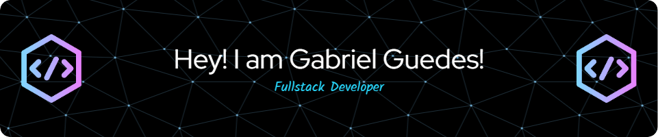
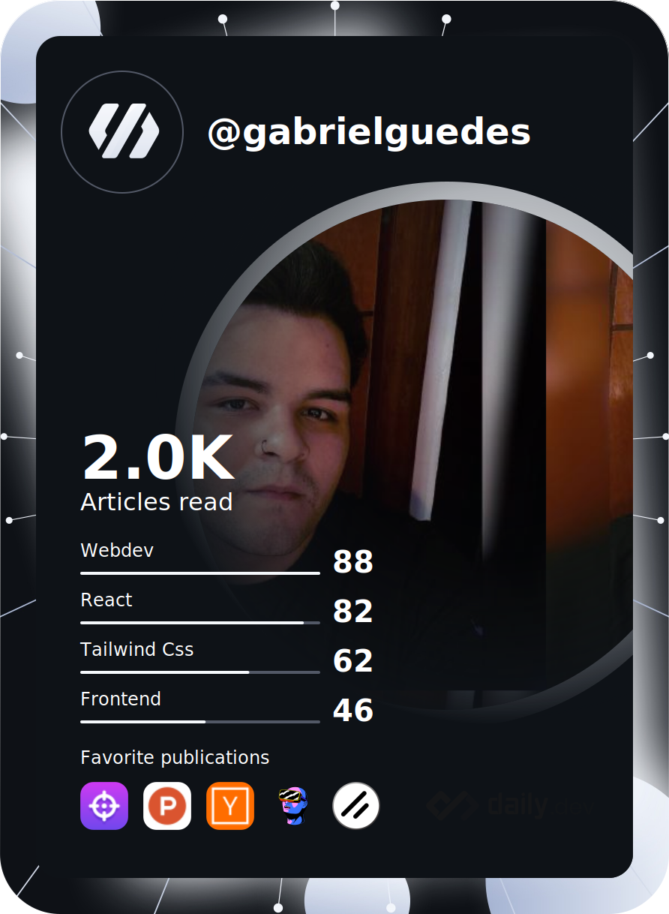
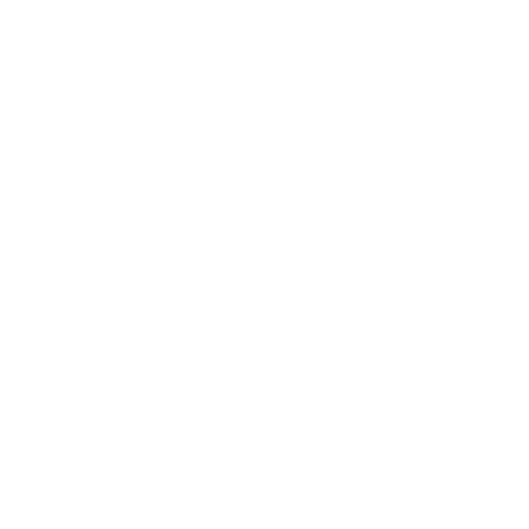
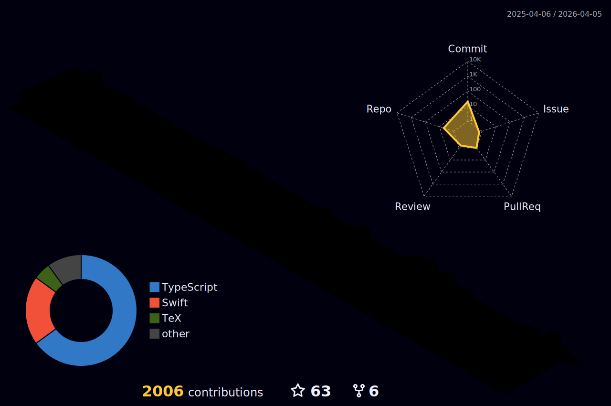
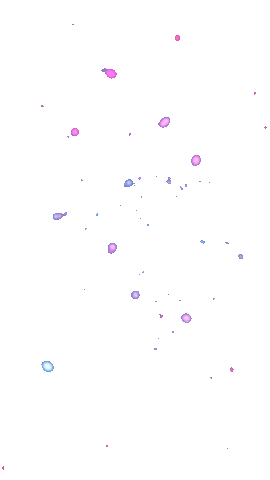

<a href="#">
  
</a>

<br />
<br />

<div align="center">
  <a href="#">
    
  </a>

  <a href="#">
    
  </a>

  <a href="#">
    
  </a>
</div>

##


<br />
<br />

- 🖥️ Cursando Engenharia de Computação na instituição de ensino Centro Universitário Eniac.
- 🖥️ Sou formado em Análise e Desenvolvimento de Sistemas na instituição de ensino Fatec Guarulhos.
- 💻 Sou formado em Técnico de Informática.
- 🤟 Cursando Inglês na instituição de ensino Wizard.
- 🏡 Sou Brasileiro, moro em Guarulhos-SP.

<div align="right">
  <a href="#">
    
  </a>
</div>

<a align="left" href="#"></a>

<br />

<div align="center">
  <a href="#">
    
  </a>

  <a href="#">
    
  </a>
</div>

<br />

<div align="center">

[](#)

</div>

<br />

<div align="right">
  <a href="#">
    
  </a>
</div>

<a align="left" href="#"></a>

## 📈 Análise de Desenvolvimento Semanal

[](#)

<br />
<br />

<details>
<summary><h3>:zap: Recent GitHub Activity</h3></summary>

<!--RECENT_ACTIVITY:start-->
1. ⬆️ Pushed 1 commit(s) to [GabrielGuedess/CodeLeap](https://github.com/GabrielGuedess/CodeLeap)<br>
2. ⬆️ Pushed 1 commit(s) to [GabrielGuedess/CodeLeap](https://github.com/GabrielGuedess/CodeLeap)<br>
3. ⬆️ Pushed 1 commit(s) to [GabrielGuedess/CodeLeap](https://github.com/GabrielGuedess/CodeLeap)<br>
4. ⭐ Starred [DavidHDev/react-bits](https://github.com/DavidHDev/react-bits)<br>
5. ⭐ Starred [DavidHDev/react-bits](https://github.com/DavidHDev/react-bits)<br>
6. ⬆️ Pushed 1 commit(s) to [GabrielGuedess/CodeLeap](https://github.com/GabrielGuedess/CodeLeap)<br>
<!--RECENT_ACTIVITY:end-->

<!--RECENT_ACTIVITY:last_update-->
<p align="center">Last refresh: <b>Monday, March 31st, 2025, 9:19:47 AM BRT</b>
<!--RECENT_ACTIVITY:last_update_end-->

</details>

<details>
<summary><h3>:clock230: WakaTime Stats</h3></summary>

  <!--START_SECTION:waka-->


**🐱 Meus dados no GitHub** 

> 📦 2.6 MB Usado no armazenamento do GitHub 
 > 
> 🏆 88 Contribuições no ano de 2025
 > 
> 💼 Aberto para contratação
 > 
> 📜 57 Repositórios Públicos 
 > 
> 🔑 5 Repositórios Privados 
 > 
**Eu sou diurno 🐤** 

```text
🌞 Manhã                  2950 commits        ███████░░░░░░░░░░░░░░░░░░   27.73 % 
🌆 Tarde                  2644 commits        ██████░░░░░░░░░░░░░░░░░░░   24.85 % 
🌃 Noite                  2643 commits        ██████░░░░░░░░░░░░░░░░░░░   24.84 % 
🌙 Madrugada              2401 commits        ██████░░░░░░░░░░░░░░░░░░░   22.57 % 
```
📅 **Sou mais produtivo em Sexta-Feira** 

```text
Segunda-Feira            1452 commits        ███░░░░░░░░░░░░░░░░░░░░░░   13.65 % 
Terça-Feira              2128 commits        █████░░░░░░░░░░░░░░░░░░░░   20.00 % 
Quarta-Feira             1708 commits        ████░░░░░░░░░░░░░░░░░░░░░   16.06 % 
Quinta-Feira             1458 commits        ███░░░░░░░░░░░░░░░░░░░░░░   13.71 % 
Sexta-Feira              2189 commits        █████░░░░░░░░░░░░░░░░░░░░   20.58 % 
Sábado                   716 commits         ██░░░░░░░░░░░░░░░░░░░░░░░   06.73 % 
Domingo                  987 commits         ██░░░░░░░░░░░░░░░░░░░░░░░   09.28 % 
```


📊 **Esta semana eu gastei meu tempo em** 

```text
🔥 Editores: 
VS Code                  19 hrs 27 mins      █████████████████████████   100.00 % 

💻 Sistema operacional: 
Linux                    19 hrs 27 mins      █████████████████████████   100.00 % 
```

**Eu geralmente programo em TypeScript** 

```text
TypeScript               54 repos            █████████████████░░░░░░░░   66.67 % 
JavaScript               7 repos             ██░░░░░░░░░░░░░░░░░░░░░░░   08.64 % 
HTML                     4 repos             █░░░░░░░░░░░░░░░░░░░░░░░░   04.94 % 
Python                   2 repos             █░░░░░░░░░░░░░░░░░░░░░░░░   02.47 % 
Dockerfile               1 repo              ░░░░░░░░░░░░░░░░░░░░░░░░░   01.23 % 
```


 Last Updated on 20/02/2025 01:32:55 UTC
<!--END_SECTION:waka-->
</details>

<details>
  <summary><h3>:bookmark: DevCard</h3></summary>

  <a href="#">
    
  </a>

</details>

<a align="left" href="#"></a>

<div align="center">
  <a href="#">
    
  </a>
</div>

<div align="center">
  <a href="#">
    
    
    
  </a>
</div>

<div align="right">
  <a href="#">
    
  </a>
</div>

<br/>

<a align="left" href="#"></a>

[](#)

##

<div align="left">
 <a href="mailto:gabrielrguedess@gmail.com" target="_blank">
  
 </a>

 <a href="https://www.facebook.com/gabriel.guedes.7921" target="_blank">
  
 </a>

 <a href="https://www.instagram.com/gabriel_rguedes" target="_blank">
  
 </a>

 <a href="https://twitter.com/Gabriel33571363" target="_blank">
  
 </a>

 <a href="https://www.linkedin.com/in/gabriel-guedes-847424204" target="_blank">
  
 </a>
</div>

<div align="right">
 
</div>

 <br/>
 <br/>

 <div align="center">
  <a href="https://open.spotify.com/user/l9hb9qtvjvuk3gxt5xq93enxf">
    
  </a>
 </div>

 <br/>

<div align="center">
  <a href="#">
    
  </a>

  <a href="https://open.spotify.com/user/l9hb9qtvjvuk3gxt5xq93enxf" target="_blank">
    
  </a>

  <a href="#">
    
  </a>
</div>

<br />

<div align="center">

[](https://open.spotify.com/user/l9hb9qtvjvuk3gxt5xq93enxf)

[](https://open.spotify.com/user/l9hb9qtvjvuk3gxt5xq93enxf)

</div>

<br />
<br />
<br />

[](#)

<a href="#">
  
</a>

<br />

<a href="#">
  
</a>

<a align="left" href="#"></a>

<br />
<br />
<br />

<h2 align="center">🤝 Support</h2>




<p align="center">💜 If you like my projects, Give them ⭐ and Share it with friends!</p>

<p align="center">Made with ❤️ in Brazil </p>

<h1 align="center">⚡️<i>Stay awesome!</i>⚡️</h1>

<p align="center">
  
</p>
