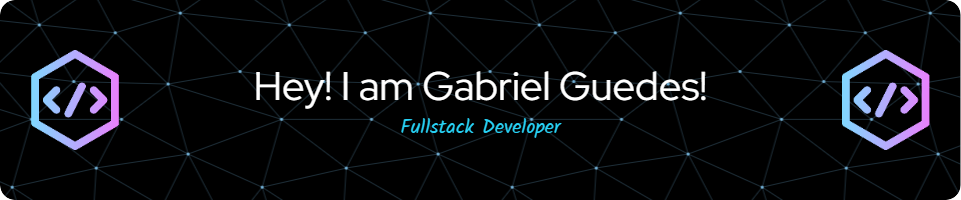
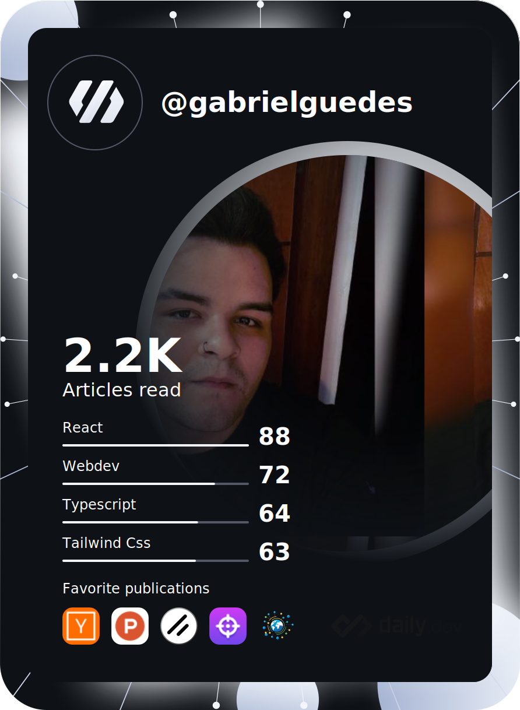
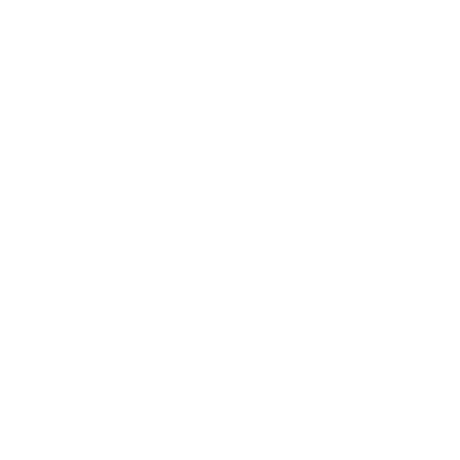
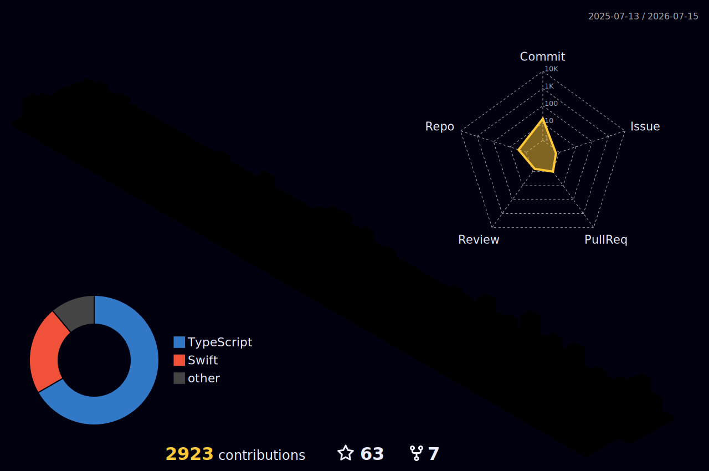
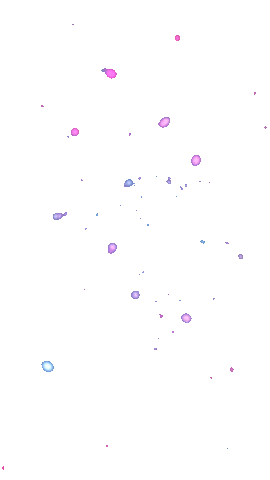

<a href="#">
  
</a>

<br />
<br />

<div align="center">
  <a href="#">
    
  </a>

  <a href="#">
    
  </a>

  <a href="#">
    
  </a>
</div>

##


<br />
<br />

- 🖥️ Sou formado em Engenharia de Computação na instituição de ensino Centro Universitário Eniac.
- 🖥️ Sou formado em Análise e Desenvolvimento de Sistemas na instituição de ensino Fatec Guarulhos.
- 💻 Sou formado em Técnico de Informática.
- 🤟 Cursando Inglês na instituição de ensino Wizard.
- 🏡 Sou Brasileiro, moro em Guarulhos-SP.

<div align="right">
  <a href="#">
    
  </a>
</div>

<a align="left" href="#"></a>

<br />

<div align="center">
  <a href="#">
    
  </a>

  <a href="#">
    
  </a>
</div>

<br />

<div align="center">

[](#)

</div>

<br />

<div align="right">
  <a href="#">
    
  </a>
</div>

<a align="left" href="#"></a>

## 📈 Análise de Desenvolvimento Semanal

[](#)

<br />
<br />

<details>
<summary><h3>:zap: Recent GitHub Activity</h3></summary>

<!--RECENT_ACTIVITY:start-->
1. ⬆️ Pushed undefined commit(s) to [GabrielGuedess/CodeLeap](https://github.com/GabrielGuedess/CodeLeap)<br>
2. ⬆️ Pushed undefined commit(s) to [GabrielGuedess/CodeLeap](https://github.com/GabrielGuedess/CodeLeap)<br>
3. ⭐ Starred [dgtlmoon/changedetection.io](https://github.com/dgtlmoon/changedetection.io)<br>
4. ⬆️ Pushed undefined commit(s) to [GabrielGuedess/CodeLeap](https://github.com/GabrielGuedess/CodeLeap)<br>
5. ⬆️ Pushed undefined commit(s) to [GabrielGuedess/CodeLeap](https://github.com/GabrielGuedess/CodeLeap)<br>
6. ⭐ Starred [dalisoft/awesome-ui-libraries](https://github.com/dalisoft/awesome-ui-libraries)<br>
7. ⭐ Starred [millionco/react-doctor](https://github.com/millionco/react-doctor)<br>
<!--RECENT_ACTIVITY:end-->

<!--RECENT_ACTIVITY:last_update-->
<p align="center">Last refresh: <b>Saturday, March 21st, 2026, 6:43:41 PM BRT</b>
<!--RECENT_ACTIVITY:last_update_end-->

</details>

<details>
<summary><h3>:clock230: WakaTime Stats</h3></summary>

  <!--START_SECTION:waka-->


**🐱 Meus dados no GitHub** 

> 📦 2.6 MB Usado no armazenamento do GitHub 
 > 
> 🏆 0 Contribuições no ano de 2026
 > 
> 💼 Aberto para contratação
 > 
> 📜 59 Repositórios Públicos 
 > 
> 🔑 18 Repositórios Privados 
 > 
**Eu sou diurno 🐤** 

```text
🌞 Manhã                  8131 commits        █████████░░░░░░░░░░░░░░░░   34.76 % 
🌆 Tarde                  7686 commits        ████████░░░░░░░░░░░░░░░░░   32.86 % 
🌃 Noite                  4706 commits        █████░░░░░░░░░░░░░░░░░░░░   20.12 % 
🌙 Madrugada              2866 commits        ███░░░░░░░░░░░░░░░░░░░░░░   12.25 % 
```
📅 **Sou mais produtivo em Terça-Feira** 

```text
Segunda-Feira            3275 commits        ████░░░░░░░░░░░░░░░░░░░░░   14.00 % 
Terça-Feira              4698 commits        █████░░░░░░░░░░░░░░░░░░░░   20.09 % 
Quarta-Feira             4025 commits        ████░░░░░░░░░░░░░░░░░░░░░   17.21 % 
Quinta-Feira             3177 commits        ███░░░░░░░░░░░░░░░░░░░░░░   13.58 % 
Sexta-Feira              4675 commits        █████░░░░░░░░░░░░░░░░░░░░   19.99 % 
Sábado                   2094 commits        ██░░░░░░░░░░░░░░░░░░░░░░░   08.95 % 
Domingo                  1445 commits        ██░░░░░░░░░░░░░░░░░░░░░░░   06.18 % 
```


📊 **Esta semana eu gastei meu tempo em** 

```text
🔥 Editores: 
VS Code                  11 hrs 29 mins      █████████████████████░░░░   83.27 % 
Zed                      2 hrs 18 mins       ████░░░░░░░░░░░░░░░░░░░░░   16.73 % 

💻 Sistema operacional: 
Linux                    9 hrs 15 mins       █████████████████░░░░░░░░   67.05 % 
WSL                      3 hrs 26 mins       ██████░░░░░░░░░░░░░░░░░░░   24.91 % 
Mac                      1 hr 6 mins         ██░░░░░░░░░░░░░░░░░░░░░░░   08.04 % 
```

**Eu geralmente programo em TypeScript** 

```text
TypeScript               72 repos            ██████████████████░░░░░░░   72.00 % 
HTML                     4 repos             █░░░░░░░░░░░░░░░░░░░░░░░░   04.00 % 
Python                   2 repos             ░░░░░░░░░░░░░░░░░░░░░░░░░   02.00 % 
Swift                    1 repo              ░░░░░░░░░░░░░░░░░░░░░░░░░   01.00 % 
TeX                      1 repo              ░░░░░░░░░░░░░░░░░░░░░░░░░   01.00 % 
```


 Last Updated on 01/01/2026 02:14:45 UTC
<!--END_SECTION:waka-->
</details>

<details>
  <summary><h3>:bookmark: DevCard</h3></summary>

  <a href="#">
    
  </a>

</details>

<a align="left" href="#"></a>

<div align="center">
  <a href="#">
    
  </a>
</div>

<div align="center">
  <a href="#">
    
    
    
  </a>
</div>

<div align="right">
  <a href="#">
    
  </a>
</div>

<br/>

<a align="left" href="#"></a>

[](#)

##

<div align="left">
 <a href="mailto:gabrielrguedess@gmail.com" target="_blank">
  
 </a>

 <a href="https://www.facebook.com/gabriel.guedes.7921" target="_blank">
  
 </a>

 <a href="https://www.instagram.com/gabriel_rguedes" target="_blank">
  
 </a>

 <a href="https://twitter.com/Gabriel33571363" target="_blank">
  
 </a>

 <a href="https://www.linkedin.com/in/gabriel-guedes-847424204" target="_blank">
  
 </a>
</div>

<div align="right">
 
</div>

 <br/>
 <br/>

 <div align="center">
  <a href="https://open.spotify.com/user/l9hb9qtvjvuk3gxt5xq93enxf">
    
  </a>
 </div>

 <br/>

<div align="center">
  <a href="#">
    
  </a>

  <a href="https://open.spotify.com/user/l9hb9qtvjvuk3gxt5xq93enxf" target="_blank">
    
  </a>

  <a href="#">
    
  </a>
</div>

<br />

<div align="center">

[](https://open.spotify.com/user/l9hb9qtvjvuk3gxt5xq93enxf)

[](https://open.spotify.com/user/l9hb9qtvjvuk3gxt5xq93enxf)

</div>

<br />
<br />
<br />

[](#)

<a href="#">
  
</a>

<br />

<a href="#">
  
</a>

<a align="left" href="#"></a>

<br />
<br />
<br />

<h2 align="center">🤝 Support</h2>




<p align="center">💜 If you like my projects, Give them ⭐ and Share it with friends!</p>

<p align="center">Made with ❤️ in Brazil </p>

<h1 align="center">⚡️<i>Stay awesome!</i>⚡️</h1>

<p align="center">
  
</p>
