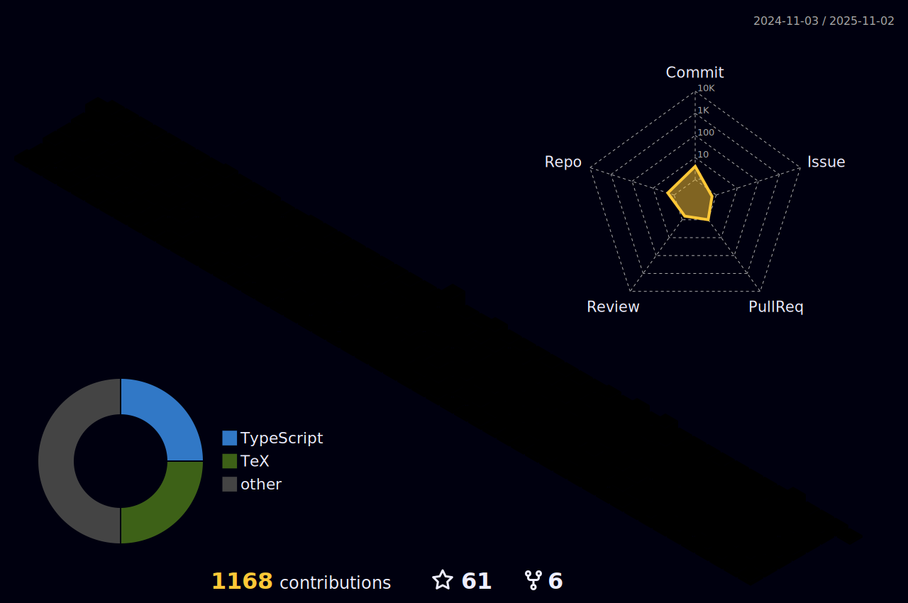

<a href="#">
  
</a>

<br />
<br />

<div align="center">
  <a href="#">
    
  </a>

  <a href="#">
    
  </a>

  <a href="#">
    
  </a>
</div>

##


<br />
<br />

- 🖥️ Cursando Engenharia de Computação na instituição de ensino Centro Universitário Eniac.
- 🖥️ Cursando Análise e Desenvolvimento de Sistemas na instituição de ensino Fatec Guarulhos.
- 💻 Sou formado em Técnico de Informática.
- 🤟 Cursando Inglês na instituição de ensino Wizard.
- 🏡 Sou Brasileiro, moro em Guarulhos-SP.

<div align="right">
  <a href="#">
    
  </a>
</div>

<a align="left" href="#"></a>

<br />

<div align="center">
  <a href="#">
    
  </a>

  <a href="#">
    
  </a>
</div>

<br />

<div align="center">

[](#)

</div>

<br />

<a align="left" href="#"></a>

## 📈 Análise de Desenvolvimento Semanal

[](#)

<br />
<br />

<details>
<summary><h3>:zap: Recent GitHub Activity</h3></summary>

<!--RECENT_ACTIVITY:start-->
1. ⬆️ Pushed 1 commit(s) to [GabrielGuedess/GabrielGuedess](https://github.com/GabrielGuedess/GabrielGuedess)<br>
2. ⬆️ Pushed 1 commit(s) to [GabrielGuedess/GabrielGuedess](https://github.com/GabrielGuedess/GabrielGuedess)<br>
3. ⬆️ Pushed 2 commit(s) to [GabrielGuedess/git-avancado](https://github.com/GabrielGuedess/git-avancado)<br>
4. 🎉 Merged PR [#1](https://github.com/GabrielGuedess/git-avancado/pull/1) in [GabrielGuedess/git-avancado](https://github.com/GabrielGuedess/git-avancado)<br>
5. 💪 Opened PR [#1](https://github.com/GabrielGuedess/git-avancado/pull/1) in [GabrielGuedess/git-avancado](https://github.com/GabrielGuedess/git-avancado)<br>
6. ⬆️ Pushed 1 commit(s) to [GabrielGuedess/Movie-Play](https://github.com/GabrielGuedess/Movie-Play)<br>
7. ⭐ Starred [WrathChaos/react-native-header-view](https://github.com/WrathChaos/react-native-header-view)<br>
8. ⬆️ Pushed 1 commit(s) to [GabrielGuedess/GabrielGuedess](https://github.com/GabrielGuedess/GabrielGuedess)<br>
9. ⭐ Starred [alii/azs](https://github.com/alii/azs)<br>
10. ✔️ Closed issue [#1](https://github.com/GabrielGuedess/Rentx-Mobile/issues/1) in [GabrielGuedess/Rentx-Mobile](https://github.com/GabrielGuedess/Rentx-Mobile)<br>
<!--RECENT_ACTIVITY:end-->

<!--RECENT_ACTIVITY:last_update-->
<p align="center">Last refresh: <b>Wednesday, January 11th, 2023, 7:38:44 AM BRT</b>
<!--RECENT_ACTIVITY:last_update_end-->

</details>

<details>
<summary><h3>:clock230: WakaTime Stats</h3></summary>

  <!--START_SECTION:waka-->


**🐱 Meus dados no GitHub** 

> 🏆 40 Contribuições no ano de 2023
 > 
> 📦 1.4 MB Usado no armazenamento do GitHub 
 > 
> 🚫 Não aberto para contratação
 > 
> 📜 37 Repositórios Públicos 
 > 
> 🔑 2 Repositórios Privados  
 > 
**Eu sou noturno 🦉** 

```text
🌞 Manhã      36 commits     █░░░░░░░░░░░░░░░░░░░░░░░░   7.41% 
🌆 Tarde      94 commits     ████░░░░░░░░░░░░░░░░░░░░░   19.34% 
🌃 Noite      214 commits    ███████████░░░░░░░░░░░░░░   44.03% 
🌙 Madrugada  142 commits    ███████░░░░░░░░░░░░░░░░░░   29.22%

```
📅 **Sou mais produtivo em Sexta-Feira** 

```text
Segunda-Feira56 commits     ███░░░░░░░░░░░░░░░░░░░░░░   11.52% 
Terça-Feira  74 commits     ███░░░░░░░░░░░░░░░░░░░░░░   15.23% 
Quarta-Feira 71 commits     ███░░░░░░░░░░░░░░░░░░░░░░   14.61% 
Quinta-Feira 84 commits     ████░░░░░░░░░░░░░░░░░░░░░   17.28% 
Sexta-Feira  93 commits     ████░░░░░░░░░░░░░░░░░░░░░   19.14% 
Sábado       27 commits     █░░░░░░░░░░░░░░░░░░░░░░░░   5.56% 
Domingo      81 commits     ████░░░░░░░░░░░░░░░░░░░░░   16.67%

```


📊 **Esta semana eu gastei meu tempo em** 

```text
🔥 Editores: 
VS Code                  29 hrs 42 mins      █████████████████████████   100.0%

💻 Sistema operacional: 
WSL                      21 hrs 5 mins       █████████████████░░░░░░░░   71.0% 
Windows                  8 hrs 36 mins       ███████░░░░░░░░░░░░░░░░░░   29.0%

```

**Eu geralmente programo em TypeScript** 

```text
TypeScript               22 repos            █████████████░░░░░░░░░░░░   52.38% 
JavaScript               5 repos             ███░░░░░░░░░░░░░░░░░░░░░░   11.9% 
C#                       5 repos             ███░░░░░░░░░░░░░░░░░░░░░░   11.9% 
Java                     4 repos             ██░░░░░░░░░░░░░░░░░░░░░░░   9.52% 
HTML                     3 repos             █░░░░░░░░░░░░░░░░░░░░░░░░   7.14%

```


 Last Updated on 11/01/2023 01:29:16 UTC
<!--END_SECTION:waka-->
</details>

<details>
  <summary><h3>:bookmark: DevCard</h3></summary>

  <a href="#">
    
  </a>

</details>

<a align="left" href="#"></a>

<div align="center">
  <a href="#">
    
  </a>
</div>

<div align="center">
  <a href="#">
    
    
    
  </a>
</div>

<div align="right">
  <a href="#">
    
  </a>
</div>

<br/>

<a align="left" href="#"></a>

[](#)

##

<div align="left">
 <a href="mailto:gabrielrguedess@gmail.com" target="_blank">
  
 </a>

 <a href="https://www.facebook.com/gabriel.guedes.7921" target="_blank">
  
 </a>

 <a href="https://www.instagram.com/gabriel_rguedes" target="_blank">
  
 </a>

 <a href="https://twitter.com/Gabriel33571363" target="_blank">
  
 </a>

 <a href="https://www.linkedin.com/in/gabriel-guedes-847424204" target="_blank">
  
 </a>
</div>

<div align="right">
 
</div>

 <br/>
 <br/>

 <div align="center">
  <a href="https://open.spotify.com/user/l9hb9qtvjvuk3gxt5xq93enxf">
    
  </a>
 </div>

 <br/>

<div align="center">
  <a href="#">
    
  </a>

  <a href="https://open.spotify.com/user/l9hb9qtvjvuk3gxt5xq93enxf" target="_blank">
    
  </a>

  <a href="#">
    
  </a>
</div>

<br />

<div align="center">

[](https://open.spotify.com/user/l9hb9qtvjvuk3gxt5xq93enxf)

[](https://open.spotify.com/user/l9hb9qtvjvuk3gxt5xq93enxf)

</div>

<br />
<br />
<br />

[](#)

<a href="#">
  
</a>

<br />

<a href="#">
  
</a>

<a align="left" href="#"></a>

<br />
<br />
<br />

<h2 align="center">🤝 Support</h2>


<p align="center">💙 If you like my projects, Give them ⭐ and Share it with friends!</p>

<p align="center">Made with ❤️ in Brazil </p>

<h1 align="center">⚡️<i>Stay awesome!</i>⚡️</h1>

<p align="center">
  
</p>
