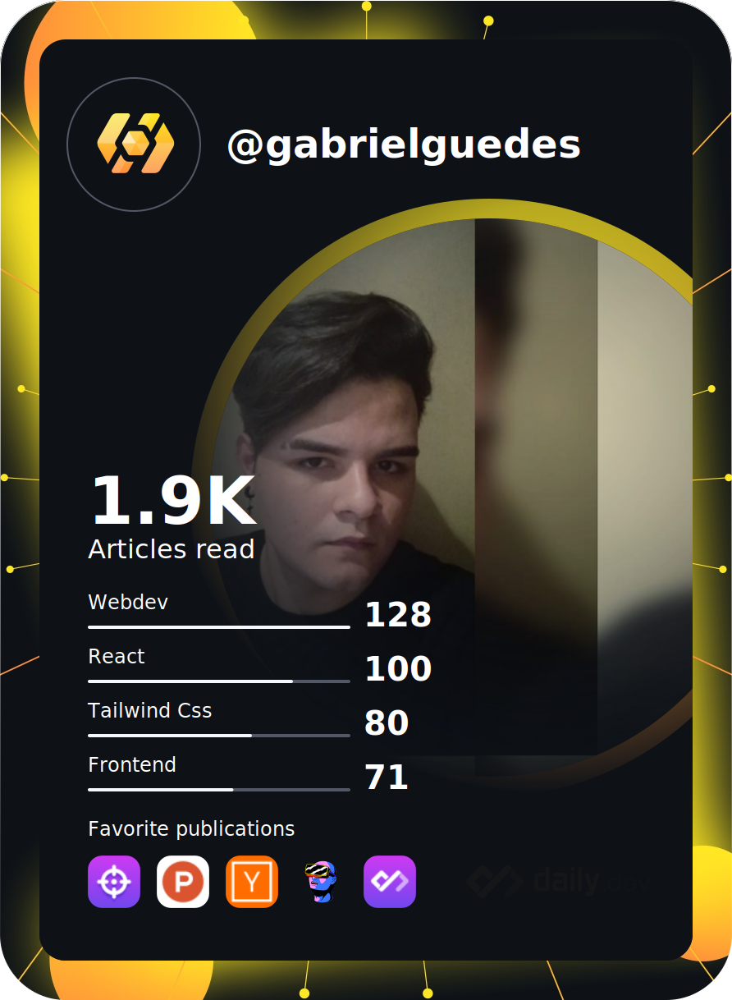

<a href="#">
  
</a>

<br />
<br />

<div align="center">
  <a href="#">
      
  </a>
  
  <a href="#">
    
  </a>
  
  <a href="#">
    
  </a>
</div>  

##


<br />
<br />

- 🖥️ Cursando Engenharia de Computação na instituição de ensino Centro Universitário Eniac.
- 🖥️ Cursando Análise e Desenvolvimento de Sistemas na instituição de ensino Fatec Guarulhos.
- 💻 Sou formado em Técnico de Informática.
- 🤟 Cursando Inglês na instituição de ensino Wizard.
- 🏡 Sou Brasileiro, moro em Guarulhos-SP.

<a align="left" href="#"></a>

<br />

<div align="center">
  <a href="#">
    
  </a>

  <a href="#">
    
  </a>
</div>

<br />

<div align="center">
  
  [](#)

</div>

<br />

<a align="left" href="#"></a>

## 📈 Análise de Desenvolvimento Semanal

[](#)

<br />
<br />

<details>
<summary><h3>:zap: Recent GitHub Activity</h3></summary>
  
<!--RECENT_ACTIVITY:start-->
1. ⭐ Starred [graphql-editor/graphql-zeus](https://github.com/graphql-editor/graphql-zeus)
2. ⬆️ Pushed 1 commit(s) to [GabrielGuedess/GabrielGuedess](https://github.com/GabrielGuedess/GabrielGuedess)
3. ⬆️ Pushed 1 commit(s) to [GabrielGuedess/GabrielGuedess](https://github.com/GabrielGuedess/GabrielGuedess)
4. ⭐ Starred [antfu/vite-plugin-pwa](https://github.com/antfu/vite-plugin-pwa)
5. ⬆️ Pushed 1 commit(s) to [GabrielGuedess/GabrielGuedess](https://github.com/GabrielGuedess/GabrielGuedess)
6. ⬆️ Pushed 1 commit(s) to [GabrielGuedess/GabrielGuedess](https://github.com/GabrielGuedess/GabrielGuedess)
7. ⬆️ Pushed 1 commit(s) to [GabrielGuedess/GabrielGuedess](https://github.com/GabrielGuedess/GabrielGuedess)
8. ⬆️ Pushed 1 commit(s) to [GabrielGuedess/GabrielGuedess](https://github.com/GabrielGuedess/GabrielGuedess)
9. ⬆️ Pushed 1 commit(s) to [GabrielGuedess/GabrielGuedess](https://github.com/GabrielGuedess/GabrielGuedess)
10. ⬆️ Pushed 1 commit(s) to [GabrielGuedess/GabrielGuedess](https://github.com/GabrielGuedess/GabrielGuedess)
<!--RECENT_ACTIVITY:end-->

<!--RECENT_ACTIVITY:last_update-->
<p align="center">Last refresh: <b>Sunday, July 3rd, 2022, 4:33:24 AM BRT</b>
<!--RECENT_ACTIVITY:last_update_end-->

</details>

<details>
<summary><h3>:clock230: WakaTime Stats</h3></summary>

  <!--START_SECTION:waka-->


**🐱 Meus dados no GitHub** 

> 🏆 137 Contribuições no ano de 2022
 > 
> 📦 287.9 kB Usado no armazenamento do GitHub 
 > 
> 🚫 Não aberto para contratação
 > 
> 📜 24 Repositórios Públicos 
 > 
> 🔑 2 Repositórios Privados  
 > 
**Eu sou noturno 🦉** 

```text
🌞 Manhã      16 commits     █░░░░░░░░░░░░░░░░░░░░░░░░   6.53% 
🌆 Tarde      35 commits     ███░░░░░░░░░░░░░░░░░░░░░░   14.29% 
🌃 Noite      134 commits    █████████████░░░░░░░░░░░░   54.69% 
🌙 Madrugada  60 commits     ██████░░░░░░░░░░░░░░░░░░░   24.49%

```
📅 **Sou mais produtivo em domingo** 

```text
Segunda-Feira25 commits     ██░░░░░░░░░░░░░░░░░░░░░░░   10.2% 
Terça-Feira  47 commits     ████░░░░░░░░░░░░░░░░░░░░░   19.18% 
Quarta-Feira 39 commits     ████░░░░░░░░░░░░░░░░░░░░░   15.92% 
Quinta-Feira 46 commits     ████░░░░░░░░░░░░░░░░░░░░░   18.78% 
Sexta-Feira  29 commits     ███░░░░░░░░░░░░░░░░░░░░░░   11.84% 
sábado       4 commits      ░░░░░░░░░░░░░░░░░░░░░░░░░   1.63% 
domingo      55 commits     █████░░░░░░░░░░░░░░░░░░░░   22.45%

```


📊 **Esta semana eu gastei meu tempo em** 

```text
🔥 Editores: 
VS Code                  1 hr 5 mins         ██████████████████░░░░░░░   71.68% 
Zsh                      25 mins             ███████░░░░░░░░░░░░░░░░░░   28.32%

💻 Sistema operacional: 
WSL                      1 hr 31 mins        █████████████████████████   100.0%

```

**Eu geralmente programo em TypeScript** 

```text
TypeScript               15 repos            █████████████░░░░░░░░░░░░   51.72% 
JavaScript               5 repos             ████░░░░░░░░░░░░░░░░░░░░░   17.24% 
C#                       5 repos             ████░░░░░░░░░░░░░░░░░░░░░   17.24% 
HTML                     3 repos             ██░░░░░░░░░░░░░░░░░░░░░░░   10.34% 
CSS                      1 repo              ░░░░░░░░░░░░░░░░░░░░░░░░░   3.45%

```


 Last Updated on 03/07/2022 02:03:05 UTC
<!--END_SECTION:waka-->
</details>

<details>
  <summary><h3>:bookmark: DevCard</h3></summary>
  
  <a href="#">
    
  </a>
  
</details>

<a align="left" href="#"></a>

<div align="center">
  <a href="#">
    
  </a>
</div>
  
<div align="center">
  <a href="#">
    
    
    
  </a>
</div>

<div align="right">
  <a href="#">
    
  </a>
</div>

<br/>

<a align="left" href="#"></a>

  
[](#)
  
##

<div align="left"> 
 <a href="mailto:gabrielrguedess@gmail.com" target="_blank">
  
 </a>

 <a href="https://www.facebook.com/gabriel.guedes.7921" target="_blank">
  
 </a>

 <a href="https://www.instagram.com/gabriel_rguedes" target="_blank">
  
 </a>

 <a href="https://twitter.com/Gabriel33571363" target="_blank">
  
 </a>

 <a href="https://www.linkedin.com/in/gabriel-guedes-847424204" target="_blank">
  
 </a>
</div>

<div align="right">
 
</div>
 
 <br/>
 <br/>
 
 <div align="center">
  <a href="https://open.spotify.com/user/l9hb9qtvjvuk3gxt5xq93enxf">
    
  </a>
 </div>
 
 <br/>
 
<div align="center">
  <a href="#">
    
  </a>
  
  <a href="https://open.spotify.com/user/l9hb9qtvjvuk3gxt5xq93enxf" target="_blank">
    
  </a>
  
  <a href="#">
    
  </a>
</div>

<br />

<div align="center">
  
  [](https://open.spotify.com/user/l9hb9qtvjvuk3gxt5xq93enxf)
       
  [](https://open.spotify.com/user/l9hb9qtvjvuk3gxt5xq93enxf)
  
</div>

<br />
<br />
<br />
 
[](#)

<a href="#">
  
</a>

<br />
 
<a href="#">
  
</a>
